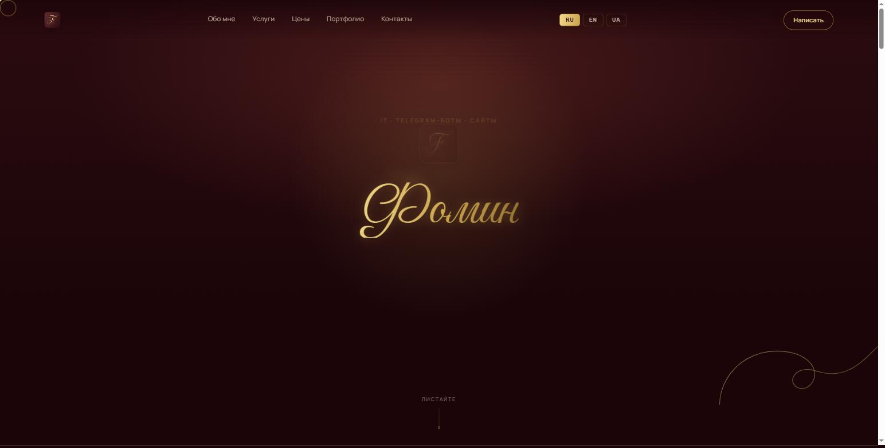

# fomin-developer

**Live site:** [fomin-developer.pages.dev](https://fomin-developer.pages.dev)

A single-page portfolio site for a freelance developer specializing in Telegram bots and business websites. Built from scratch with plain HTML/CSS/JS — no frameworks, no build-heavy tooling — and optimized to load fast and feel polished on both desktop and mobile.



## About this project

This site is my professional portfolio: it presents my services, pricing, and case studies of real client work (a Telegram bot for a flower shop, a restaurant website, and a catalog site for a modular-housing company). I designed, coded, and deployed every part of it myself — copy, layout, animation, and infrastructure.

I'm sharing it here as a work sample: it demonstrates my approach to front-end engineering (semantic markup, custom animation without heavy dependencies, a from-scratch i18n system, and an automated asset pipeline) as well as product thinking (pricing structure, case-study writing, conversion-oriented layout).

## Features

- **Custom cursor & particle background** — a lightweight canvas-based particle field with proximity connections, plus a magnetic-button and 3D tilt-card interaction layer, all written in vanilla JS.
- **Scroll-driven animation** — GSAP + ScrollTrigger for parallax on the hero section, combined with a native `IntersectionObserver` reveal system for content sections (with a `prefers-reduced-motion` fallback that disables all animation).
- **Three-language i18n from scratch** — RU / EN / UA switching via a small `data-i18n` attribute system and a JSON dictionary per language, fetched on demand and cached, with the default language persisted in `localStorage`.
- **Draggable, responsive case-study galleries** — horizontal scroll-snap image galleries per project, with mouse-drag support on desktop and native touch scroll on mobile.
- **Automated image pipeline** — a Node build script generates WebP versions of every JPEG and minifies CSS/JS, so the repo's source files stay readable while the deployed site serves optimized assets.
- **Offline-friendly** — a service worker caches the app shell for repeat visits.
- **Accessibility basics** — skip-to-content link, `aria-pressed`/`aria-expanded` state on interactive controls, and reduced-motion support throughout.

## Tech stack

| Layer | Choice |
|---|---|
| Markup / styling | Semantic HTML5, hand-written CSS (custom properties, Grid/Flexbox, no framework) |
| Animation | [GSAP](https://gsap.com/) + ScrollTrigger, native `IntersectionObserver` |
| Interactivity | Vanilla JavaScript (ES6+, no framework) |
| i18n | Custom `data-i18n` + JSON dictionaries, no library |
| Build tooling | Node.js script using `clean-css-cli`, `terser`, and `sharp` |
| Hosting | Cloudflare Pages (static hosting, auto-deploy from this repo) |

## Project structure

```
index.html                 page markup (source of truth for content)
css/style.css               source stylesheet
css/style.min.css           minified build output (generated, do not edit by hand)
js/main.js                  source script
js/main_min.js               minified build output (generated, do not edit by hand)
i18n/ru.json, en.json, ua.json   translation dictionaries, loaded via fetch on language switch
assets/                      images (original .jpg + generated .webp)
docs/                        README assets (screenshots)
sw.js                        service worker for offline caching
scripts/build.js             build script: CSS/JS minification + WebP generation
robots.txt, sitemap.xml      SEO
_headers                     Cloudflare Pages cache-control headers
```

## Getting started

```bash
npm install
npm run build          # generates css/style.min.css, js/main_min.js, assets/*.webp
npx serve .             # or any static file server — i18n uses fetch(), so file:// won't work
```

Then open the printed local URL in your browser.

## Making changes

Edit the source files only — `index.html`, `css/style.css`, `js/main.js`, and the `i18n/*.json` dictionaries. After changing any CSS/JS or adding new images to `assets/`, rebuild the generated files:

```bash
npm run build
```

This regenerates `css/style.min.css`, `js/main_min.js`, and a `.webp` copy of every `.jpg` in `assets/`.

## Deployment

The site auto-deploys to [Cloudflare Pages](https://pages.cloudflare.com/) on every push to `main`. Cloudflare builds and serves the repository directly — no CI config needed beyond the Pages project settings (build command: `npm run build`, output directory: `/`).

---

© 2026 Nikita Fomin
